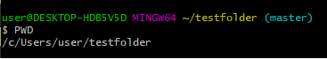

GIT 명령어

PWD 현재 경로 출력

TOUCH 파일 생성(확장자 붙여야 한다)

start
- start . 현재 경로의 폴더 열기
- start TIL_day01.md 파일 열기

mkdir

- 파일 생성


ls (LIST FILE)

- ls-a (숨김 파일까지 조회)

- ls-l (언제만들었는지까지)

MV 파일이동 / 이름변경  

- 파일 이동 mv b.txt TIL
- 파일 이름 변경 mv b.txt c.txt

cd 홈 폴더로 이동

- cd- 이전 경로로 이동
- cd . 현재 디렉토리
- cd .. 상위 디렉토리로 이동

rm 파일 지우기

- rm - r 폴더 지우기 (폴더 내용 전부)





상대경로와 절대경로

# Markdown

## 강조
1. **기울임** : `*글자*` 혹은 `_글자_`
2. **굵게** : `**글자**` 혹은 `__글자__`
3. **취소** : `~~글자~~`

## 인용
주석이나 인용 문구 표현
> '>'를 사용
> > 중첩 가능
> >
> > 


## 수평선

'- * _'을 사용하여 선 생성

***********
___________


# 표


## CLI

commend line interface
터미널을 통해 상호작용


# git

깃 폴더로 만들기

```bash
git init
```

git

- Working Directory
- Staging Area
- Repository


log 

log --oneline 한줄로 로그 출력


커밋 비교하기 

git diff 커밋ID 커밋ID


remote

$ git remote add origin 주소(https://github.com/LeeJeaHyuk/commit-practice.git)

확인

git remove -v

삭제
git remote rm origin


local commit 올리기
git push origin master

