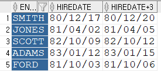
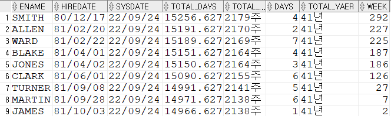
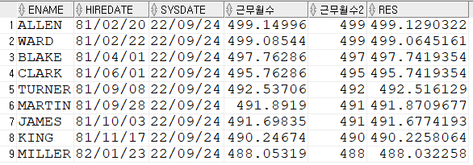
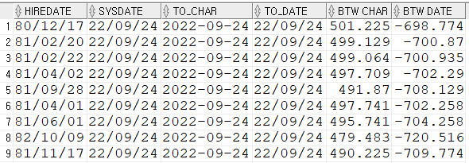

# 220924(SAT) 

## ORACLE review

db = SCOTT table

DEPT - DEPTNO, DNAME, LOC

EMP - EMPNO, ENMAE, JOB, MGR, HIRDATE, SAL, COMM, DEPTNO

SALGRADE - GRADE, LOSAL, HISAL


#### "column ambiguously defined" - 별칭 주어야 한다

```sql
SELECT ENAME, D.DEPTNO
FROM SCOTT.EMP, SCOTT.DEPT "D"; -- DOUBLE QOUTER
```


#### ROUND, TRUNC

```sql
SELECT ROUND(4567.678) RES1, ROUND(4567.678,0) RES2, 
	   ROUND(4567.678,2) RES3, ROUND(4567.678,-3) RES4
FROM DUAL;
-- 4568 4568 4567.68 5000 반올림

SELECT TRUNC(4567.678) RES1, TRUNC(4567.678,0) RES2,
	   TRUNC(4567.678,2) RES3, TRUNC(4567.678,-3) RES4
FROM DUAL;
-- 4567 4567 4567.67 4000 내림
```


#### 날짜 함수

##### 날짜에 +해보기

```sql
SELECT ENAME, HIREDATE, HIREDATE+3
FROM SCOTT.EMP
WHERE DEPTNO =20;
```




##### 사원테이블에서 사원의 현재까지의 근무일수가 몇주 몇일인지 조회

```sql
SELECT ENAME, HIREDATE, SYSDATE, TRUNC(SYSDATE-HIREDATE,3) AS "TOTAL_DAYS",
TRUNC((SYSDATE-HIREDATE)/7,0)||'주' AS "TOTAL_WEEK",
ROUND(MOD((SYSDATE-HIREDATE),7),0) DAYS,
TRUNC((SYSDATE-HIREDATE)/365,0)||'년' AS "TOTAL_YAER",
ROUND(MOD((SYSDATE-HIREDATE),365),0) WEEK
FROM SCOTT.EMP
ORDER BY 4 DESC;
```



근무일수(현재일-입사일) : SYSDATE - HIREDATE

근무일수/7 = 주

MOD(근무일수.7) = 나머지 일수 

ORDER BY DESC = TOTAL_DAYS에서 내림차순으로 정렬


##### 사원테이블에서 10번, 30번 부서의 사원들이 입사일로부터 5개월이 지난 후 날짜를 계산

```sql
SELECT ENAME,HIREDATE,SYSDATE,TRUNC(MONTHS_BETWEEN(SYSDATE,HIREDATE),5) AS 근무월수,
                              TRUNC(MONTHS_BETWEEN(SYSDATE,HIREDATE),0) 근무월수2,
                              TRUNC(MONTHS_BETWEEN(TO_CHAR(SYSDATE,'YYYY-MM-DD'),       
                                                   TO_CHAR(HIREDATE,'YYYY-MM-DD')),7) RES
FROM SCOTT.EMP
WHERE DEPTNO=10 OR DEPTNO=30
ORDER BY 4 DESC;
```




SYSDATE가 이미 DATE이기 때문에 TO_DATE(SYSDATE) 를 사용하지 않는다  

```sql
SELECT HIREDATE, SYSDATE, TO_CHAR(SYSDATE,'YYYY-MM-DD') "TO_CHAR", 
					      TO_DATE(SYSDATE,'YYYY-MM-DD') "TO_DATE",
                      TRUNC(MONTHS_BETWEEN(TO_CHAR(SYSDATE,'YYYY-MM-DD'),       
                                           TO_CHAR(HIREDATE,'YYYY-MM-DD')),3) "BTW CHAR",
                      TRUNC(MONTHS_BETWEEN(TO_DATE(SYSDATE,'YYYY-MM-DD'),       
                                           TO_DATE(HIREDATE,'YYYY-MM-DD')),3) "BTW DATE"
FROM SCOTT.EMP;
```



SYSDATE에 TO_DATE를 사용해서 일자를 계산하니 예상하지 못하는 결과가 나왔다 

TO_DATE 예시

```sql
SELECT MONTHS_BETWEEN
       (TO_DATE('02-02-1995','MM-DD-YYYY'),
        TO_DATE('01-01-1995','MM-DD-YYYY') )
FROM DUAL;
```

#### TO_DATE


##### 1900년대 2000년대

RR/MM/DD(00~49: 2000년대) , DD/MON/RR(50~99 : 1990년대)

```sql
SELECT TO_CHAR(TO_DATE('98','RR'),'YYYY') test1, 
TO_CHAR(TO_DATE('50','RR'),'YYYY') test2, 
TO_CHAR(TO_DATE('98','YY'),'YYYY') test3, 
TO_CHAR(TO_DATE('05','YY'),'YYYY') test4 
FROM  dual;
```

| test1 | test2 | test3 | test4 |
| ----- | ----- | ----- | ----- |
| 1998  | 1950  | 2098  | 2005  |

년도 범위를 벗어나면 RR/YY로 지정하더라도 해당 년도가 된다
